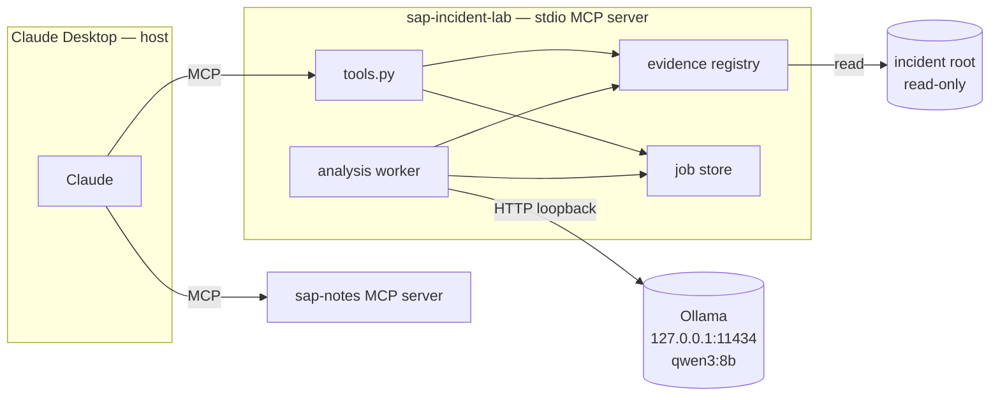
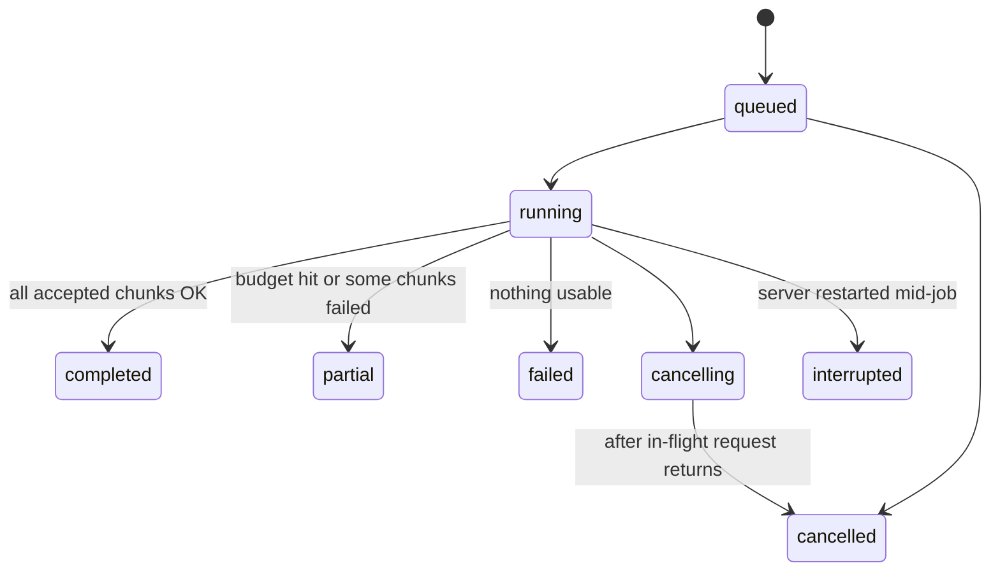

# SAP Incident Lab — Design

Status: **draft for review** · 14 September 2026
Companion to `docs/implementation-guide.md` (the "guide"). The guide is the *why*;
this document is the *what we will actually build*, corrected against the real environment.
Where they disagree, this document wins and says why.

---

## 1. Goal in one paragraph

A local, read-only MCP server that Claude Desktop calls to investigate an **exported, static**
SAP incident. The server owns the evidence (file registry, hashes, numbered lines). A local
Qwen model (Ollama) extracts observations and hypotheses from bounded chunks. Claude verifies
every material claim by pulling the exact source lines back through the server, researches
SAP Notes through the separate `sap-notes` server, and writes a ranked diagnostic shortlist.

**v1 is done when:** one resolved incident produces a supported shortlist in Claude Desktop,
every cited line range resolves to the original bytes, and coverage gaps are stated.
It is *not* required to name the root cause automatically.

---

## 2. Decisions that differ from the guide

Found by inspecting this Mac and the template `sap-mcp-dev/mcp-sap-notes-py` (read-only).
The template is a reference only; the U of T secure-defaults baseline is still applied here.

| Topic | Guide assumed | Decision | Why |
|---|---|---|---|
| Dev machine | Windows, 32 GB | **Mac (Apple M5, 24 GB) now; Windows work laptop later** | Build and test with synthetic data here; real incidents move to the institutional machine |
| MCP SDK | v1 `FastMCP`, `mcp>=1.28,<2` | **SDK v2 `MCPServer`, `mcp>=2.1,<3`** | Template runs `mcp 2.1.0`; guide says keep the template's SDK family. Guide §6 code is **not** used |
| Packaging | pip + `requirements.txt` | **uv + `pyproject.toml` (hatchling) + `uv.lock`** | Same as template; lockfile is the reproducibility record |
| Python | 3.11/3.12 | **3.14** (`.python-version`) | Template's tested interpreter |
| Logging | `logging.basicConfig` | **structlog → stderr** | Template pattern; stdout stays protocol-only |
| Config | raw `os.getenv` | **pydantic-settings `Settings`, prefix `INCIDENT_LAB_`** | Template pattern; typed, validated at startup |
| Long-running work | custom job tools | **Keep custom job tools** | MCP *tasks* is an extension, not core 2026-07-28, not implemented by the template, and Desktop support is unverified |
| Job store | JSON or SQLite | **JSON files, atomic replace** | Template uses JSON state files; human-inspectable while learning |
| Launch | `python.exe server.py` | **`uv run --directory git_projects/sap-incident-lab sap-incident-lab serve`** | Identical to how `sap-notes` is registered in Desktop today |
| Repo | new independent repo | **Standalone GitHub repo `bruce-hoppe_uoft/sap-incident-lab`, branch `main`; nested in `git_projects` and ignored by the mono-repo** | Kept separate from `sap-mcp-dev` (Azure DevOps), which holds both existing SAP servers. **No imports** from `mcp_sap_notes_py`; patterns are re-written, not copied wholesale |

Things deliberately copied from the template in spirit (re-written small, not imported):
the `audited` + `size_guarded` decorator pair on every tool, a result byte cap, stable error
payloads, and the stdio-only operating envelope.

---

## 3. Data classification gate (U of T secure defaults)

`docs/ut-secure-defaults.md` in the template applies. Two of its stop-and-ask rules touch this
project, so they are design constraints, not afterthoughts:

- **Real SAP logs are not "Level 2 by default."** Work-process and security traces routinely
  contain user IDs, hostnames, and security-sensitive operational data → treat as **Level 3–4
  until classified**.
- **Tool output enters the Claude conversation** (rule 4: data to an AI provider). Only the
  institutionally supported Claude environment may receive real evidence.
- Ollama is local and loopback-only; the server **rejects non-loopback Ollama URLs**.

**Therefore:** on this Mac, **synthetic fixtures only**. Before the first real incident
(milestone 5) you confirm the classification and the Desktop environment. The code enforces
what it can (loopback, bounded output, no paths in errors, no trace text in logs); the
classification decision is yours.

---

## 4. Architecture



Call direction: **Claude → server → Ollama → server → Claude.** The two MCP servers never
talk to each other; Claude is the only thing that uses both. Qwen has no tools.

**Process model.** One stdio process per Desktop session. The analysis worker is a single
background task started in the server's **lifespan** hook (`MCPServer(lifespan=...)`, present
in SDK v2) and cancelled on shutdown. One inference at a time. Tools never await model output.

---

## 5. Project layout

```
sap-incident-lab/             # github.com/bruce-hoppe_uoft/sap-incident-lab
├── pyproject.toml            # uv/hatchling; script: sap-incident-lab = sap_incident_lab.__main__:main
├── uv.lock
├── .python-version           # 3.14
├── .gitignore
├── config.example.env        # non-secret example values
├── README.md
├── AGENTS.md                 # agent guidance (points at DESIGN.md + secure defaults)
├── DESIGN.md                 # this file
├── docs/implementation-guide.md
├── prompts/extract-v1.txt
├── src/sap_incident_lab/
│   ├── __main__.py           # CLI: `serve`, later `probe` (Ollama smoke test)
│   ├── config.py             # Settings (pydantic-settings)
│   ├── logging_config.py     # structlog → stderr
│   ├── errors.py             # ToolError codes + recovery hints
│   ├── server.py             # MCPServer, lifespan, audited/size_guarded, tool registration
│   ├── tools.py              # thin tool bodies → services
│   ├── evidence/
│   │   ├── manifest.py       # incident.json model
│   │   ├── paths.py          # containment checks (Mac + Windows)
│   │   └── registry.py       # file IDs, hashing, decoding, line retrieval
│   ├── analysis/
│   │   ├── chunking.py
│   │   ├── ollama_client.py
│   │   ├── schemas.py        # model-owned vs app-owned fields
│   │   ├── validate.py       # reference checks, evidence reconstruction
│   │   └── worker.py
│   ├── jobs/store.py         # JSON job store, state machine, restart recovery
│   └── audit.py
└── tests/
    ├── fixtures/INC-SYN-001/ # synthetic only
    ├── unit/
    └── integration/          # mocked Ollama; one opt-in live smoke test
```

Data lives **outside** the repo:

```
~/SAPIncidentLabData/
├── incidents/<INCIDENT_ID>/incident.json + evidence files   (read-only to the server)
├── outputs/jobs/<job_id>/...                                 (server writes here only)
└── evaluation-private/                                       (never configured into the server)
```

---

## 6. Configuration (`INCIDENT_LAB_*`)

| Setting | Default | Validation |
|---|---|---|
| `ROOT` | *(required)* | absolute, exists, is a directory |
| `OUTPUT` | *(required)* | absolute; must not be inside `ROOT` and vice versa |
| `MODEL` | `qwen3:8b` | non-empty |
| `OLLAMA_URL` | `http://127.0.0.1:11434` | host must be `127.0.0.1`, `::1`, or `localhost` |
| `NUM_CTX` | `8192` | 2048–32768 |
| `NUM_PREDICT` | `1200` | 100–4096 |
| `MAX_CHUNK_LINES` / `MAX_CHUNK_CHARS` / `CHUNK_OVERLAP_LINES` | `120` / `8000` / `15` | overlap < lines |
| `MAX_FILE_MB` | `20` | |
| `MAX_CHUNKS_PER_JOB` | `20` | |
| `EVIDENCE_MAX_LINES` / `EVIDENCE_MAX_CHARS` | `120` / `16000` | |
| `TIMEOUT_SECONDS` | `180` | per Ollama request |
| `LOG_LEVEL` | `INFO` | |

Missing `ROOT`/`OUTPUT` must **not** crash startup: `health` still works and reports
`config_valid: false` with the reason. Nothing contacts Ollama at startup.

---

## 7. Evidence contract (milestone 2 — built before any model code)

### Identity
- `incident_id`: `^[A-Za-z0-9_-]{1,64}$`.
- `file_id`: derived by code, e.g. `f01`, in manifest order. Claude never sends paths.
- `sha256` over **raw bytes**; `line_count` after decoding with the **declared** encoding.
- An **evidence reference** is always `(incident_id, file_id, sha256, start_line, end_line)`,
  one-based, inclusive.

### Path containment — one function, tested on both OSes
1. Reject manifest paths that are absolute, contain `..`, a drive letter, a UNC prefix, a `:`
   (Windows alternate data streams), or NUL.
2. `candidate = (incident_dir / rel).resolve(strict=True)` — resolves symlinks (macOS) and
   junctions (Windows).
3. Require `candidate.is_relative_to(incident_dir.resolve())` and
   `incident_dir.resolve().is_relative_to(root.resolve())`.
4. Require `candidate.is_file()`, size ≤ `MAX_FILE_MB`.
5. Read with a single open; hash and decode the same bytes (no check-then-reopen race).

macOS tests prove the symlink case. **Junction and ADS cases can only be proven on Windows** —
the tests exist from day one but are marked `windows_only` and skipped here.

### Decoding
- UTF-8 BOM stripped for line numbering but included in the hash.
- CRLF and LF both split lines; blank lines preserved; no rewrapping.
- Decode errors → `DECODE_FAILED` with the byte offset, never `errors="replace"`.

### Retrieval
`get_evidence` returns at most `EVIDENCE_MAX_LINES` / `EVIDENCE_MAX_CHARS`, sets `clipped: true`
and `next_start_line` when cut. `expected_sha256` mismatch → `SOURCE_CHANGED`.

---

## 8. Tool contracts

All names prefixed `incident_lab_`. All results are JSON objects. Errors look like:

```json
{"error": {"code": "SOURCE_CHANGED", "message": "File f02 changed since inventory.",
           "recovery": "Call incident_lab_list_files again and restart analysis."}}
```

Error messages never contain absolute paths or trace text (secure defaults, logging §4).

| Tool | Milestone | Args | Returns |
|---|---|---|---|
| `health` | 1 | — | server version, config validity, Ollama reachable, model installed, model digest |
| `list_incidents` | 2 | — | incident IDs with a valid manifest (added: saves Claude guessing IDs) |
| `list_files` | 2 | `incident_id` | per file: `file_id`, relative name, sha256, bytes, line_count, encoding, warnings; plus manifest system facts with `null`s visible |
| `get_evidence` | 2 | `incident_id, file_id, start_line, end_line, expected_sha256` | numbered lines, reference, `clipped`, `next_start_line` |
| `start_analysis` | 4 | `incident_id, file_ids, question, ranges?` | `job_id`, accepted chunks, chunks over budget (disclosed, not silently dropped) |
| `get_analysis` | 4 | `job_id, cursor?` | state, progress, bounded results page, `next_cursor`, coverage |
| `cancel_analysis` | 4 | `job_id` | new state (`cancelling` if a request is in flight) |
| `save_report` | 4 | `incident_id, job_ids, markdown` | code-generated filename under `OUTPUT`, labelled Claude-authored, never overwrites a prior save |

Error codes (initial set): `CONFIG_INVALID`, `INCIDENT_NOT_FOUND`, `MANIFEST_INVALID`,
`FILE_NOT_FOUND`, `PATH_REJECTED`, `FILE_TOO_LARGE`, `DECODE_FAILED`, `RANGE_INVALID`,
`SOURCE_CHANGED`, `JOB_NOT_FOUND`, `JOB_BUSY`, `OLLAMA_UNAVAILABLE`, `MODEL_MISSING`,
`RESULT_TOO_LARGE`.

---

## 9. Analysis pipeline (milestones 3–4)

### Chunking
Deterministic: same file + same settings → same chunk IDs (`<file_id>:<start>-<end>`).
Both line and char limits apply; overlap as configured. A single line over the char cap makes
that chunk `oversize` and it is **reported as skipped**, not truncated.

### Prompt
`prompts/extract-v1.txt` is the **system** message (guide §9.2 text). The excerpt goes in the
**user** message inside explicit delimiters, labelled untrusted. Prompt version is recorded.
Ollama call: `/api/chat`, `stream:false`, `think:false`, `temperature:0`, `format=<JSON schema>`.

### Schema split — who is allowed to say what

| Model-owned (validated, bounded) | App-owned (added by code after validation) |
|---|---|
| `observations[]`: `id`, `text`, `refs[{start_line,end_line}]` | `job_id`, `chunk_id`, `file_id`, `sha256` |
| `hypotheses[]`: `text`, `supporting_obs[]`, `contradicting_obs[]`, `checks[]` | model tag + digest, prompt version, options |
| `timeline[]`: `raw_timestamp`, `event`, `ref` | Ollama timings, elapsed, token counts |
| `search_terms[]` | coverage, state, errors |
| `missing_information[]` | reconstructed quoted lines |

The model never supplies file IDs or hashes; refs carry line numbers only, and code attaches
identity from the chunk it actually sent.

### Validation
1. Pydantic parse. On failure: **one** repair request, then mark chunk `invalid_output`.
2. `done_reason == "length"` → chunk `truncated_output`, not accepted.
3. Every ref must lie inside the chunk's range → otherwise the observation is dropped and counted.
4. Quoted text is **rebuilt from the source lines**, never copied from model prose.
5. Result flags: `refs_valid` (mechanical) is reported separately from any notion of support.

### Job lifecycle



Store: `OUTPUT/jobs/<job_id>/job.json` (state, scope, coverage, provenance) and
`chunks/<chunk_id>.json` (one per processed chunk, written the moment it finishes).
Writes use temp file + `os.replace` (atomic on macOS and Windows). On startup, any
`running`/`cancelling` job becomes `interrupted`. Only one job may be `running`
(`JOB_BUSY` otherwise; queueing more than one is deferred).

---

## 10. Claude-side usage

The server's `instructions` string carries the investigation procedure (guide §10), rewritten
to name tools that actually exist. The `sap-notes` server currently exposes, among others:
`sap_notes_search`, `sap_notes_fetch`, `sap_notes_diagnose_error`, `sap_notes_analyze_note`,
`sap_notes_query`. The instructions reference those by name and tell Claude that a matching
title is a candidate, not applicability.

Desktop entry (Mac path: `~/Library/Application Support/Claude/claude_desktop_config.json`),
added **beside** the existing `sap-notes` key:

```json
"sap-incident-lab": {
  "command": "/Users/bh/.local/bin/uv",
  "args": ["run", "--directory", "/Users/bh/Developer/git_projects/sap-incident-lab",
           "sap-incident-lab", "serve"],
  "env": {
    "INCIDENT_LAB_ROOT": "/Users/bh/SAPIncidentLabData/incidents",
    "INCIDENT_LAB_OUTPUT": "/Users/bh/SAPIncidentLabData/outputs"
  }
}
```

---

## 11. Mac → Windows portability rules

- `pathlib` everywhere; no string path joins, no hard-coded separators.
- Open files in binary, decode explicitly; never rely on platform default encoding.
- Atomic writes via `os.replace`; no `rename` over existing files.
- No POSIX-only APIs (`fcntl`, signals for cancellation).
- Tests that depend on the OS are marked `windows_only` / `posix_only` rather than deleted.
- The Windows move is a checklist item, not a port: same `uv` command, Windows paths in the
  Desktop entry, run the `windows_only` tests.

---

## 12. Milestones

| # | Scope | Done when | Where | Status |
|---|---|---|---|---|
| 0 | uv project, settings, logging, `.gitignore`, mono-repo ignore entry | `uv run sap-incident-lab --help` works; `sap-mcp-dev` has no diff | Mac | **Done** |
| 1 | `health` tool, Desktop entry, `probe` CLI for Ollama | Desktop lists both servers; `health` reports model installed; probe returns synthetic analysis with timings | Mac (needs Ollama installed) | **Done** — confirmed live in Desktop |
| 2 | Manifest, registry, containment, `list_*`, `get_evidence` + tests | Exact lines round-trip; traversal/symlink/encoding/hash tests pass | Mac; junction tests on Windows | **Done** on Mac. Windows junction/ADS behavior is inferred from syntax-level rejection, not yet proven on Windows |
| 3 | Chunking, Ollama client, schema, validation | Synthetic file → validated observations with correct refs; malformed/truncated output rejected (mocked) | Mac | **Done**, plus a live qwen3:8b run against INC-SYN-001 |
| 4 | Job store, worker, start/get/cancel, restart recovery, `save_report` | Long synthetic file ends `partial` with ranges; restart → `interrupted` | Mac | **Done** — 91 tests total, including a caught-and-fixed bug (an unreachable Ollama endpoint used to strand a job in `running` forever) |
| 5 | First real incident | Supported shortlist; gaps explicit | **Windows work laptop, after §3 gate** | **Blocked on you**: needs the work laptop, U of T Claude Desktop, and your classification sign-off on the real evidence (section 3) |
| 6 | Evaluation (3–5 cases, then ~20–30) | Evidence of benefit or a clear explanation of failure | Windows laptop | **Blocked on 5**: needs real resolved cases to compare against |
| 7 | Publication | Runnable repo, synthetic demo, article | Wherever the repo ends up | **Blocked on 5–6** and on the ownership/publication check in section 13 |

Each milestone ends runnable, with tests and a README update, reviewed before the next begins.
Everything buildable without real incident data or the Windows laptop (milestones 0–4, all
seven tool contracts in section 8) is now implemented and tested end-to-end, including one
live run through the actual model. Milestones 5–7 need real input from you — see section 13.

---

## 13. Open questions for you

1. **Repo visibility (confirmed private):** keep it private until guide §12's ownership check
   is done, and commit nothing U of T-specific (SIDs, hostnames, internal paths) — fixtures
   stay fully synthetic.
2. **Ollama on the Mac:** OK to install it (Homebrew or the app) and pull `qwen3:8b` (~5.2 GB)
   for milestone 1?
3. **Synthetic incident:** do you want me to invent a realistic one (e.g. a transport import
   failing on a lock / RC 8 with a work-process trace), or would you rather describe the
   shape of your real resolved incident, sanitised, so the fixture exercises the same path?
